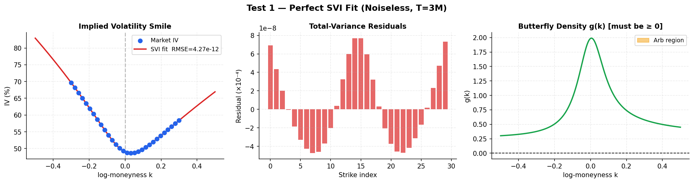
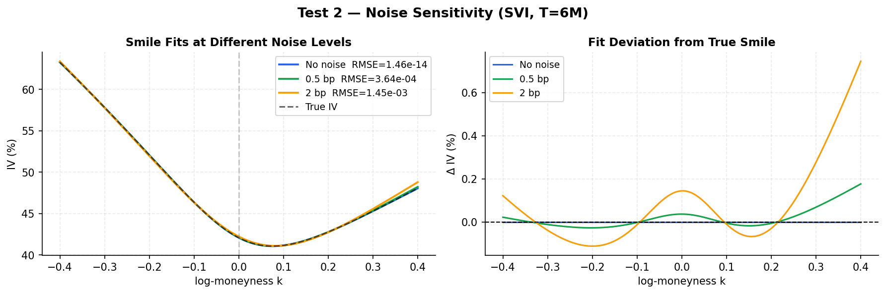
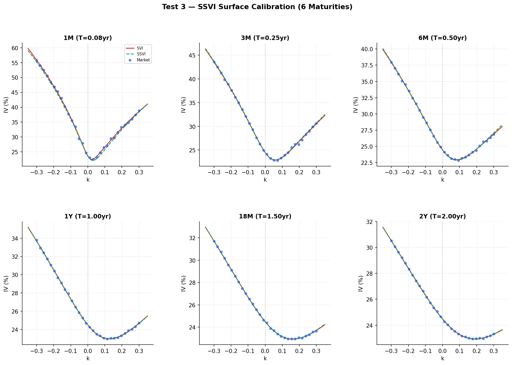
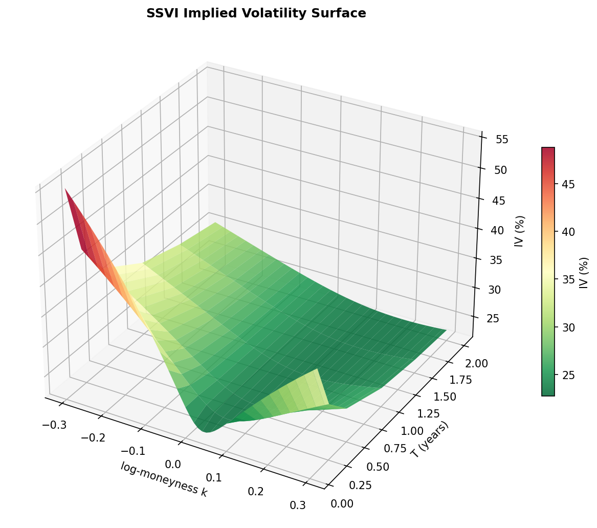
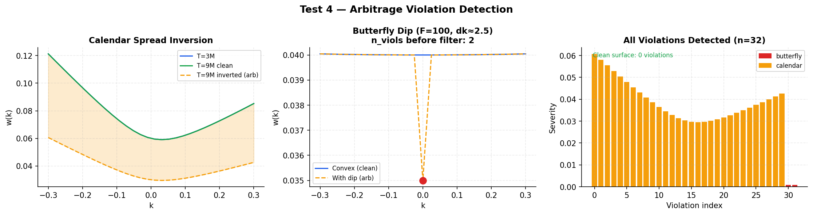
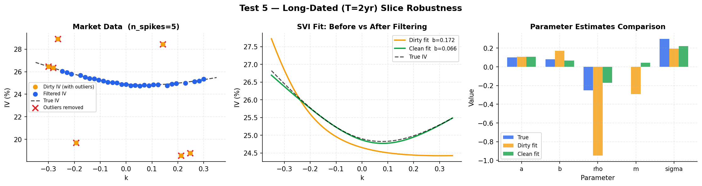

# QuantClaw — Volatility Surface Analysis Report

*Generated: 2026-03-10 08:53 UTC*

---

## Summary

This report documents five synthetic calibration tests performed against the
QuantClaw SVI/SSVI library.  All data is generated programmatically so results
are fully reproducible without a live market feed.

| Test | Description | Key Metric | Result |
|------|-------------|------------|--------|
| 1 | Perfect SVI fit (noiseless, T=3M) | Total-var RMSE | `4.2717e-12` |
| 2 | Noise sensitivity (0 / 0.5 bp / 2 bp) | RMSE at 2 bp | `1.4545e-03` |
| 3 | Full SSVI surface (6 maturities) | Surface RMSE | `3.3232e-04` |
| 4 | Arbitrage violation detection | Violations caught | `32` |
| 5 | Long-dated robustness (T=2yr, outliers) | RMSE dirty→clean | `0.0175 → 4.0475e-04` |

---

## Test 1 — Perfect SVI Fit (Noiseless, T = 3 Months)



**Setup:** 30 synthetic strikes from `a=0.04, b=0.2, ρ=-0.3, m=0, σ=0.1`, zero noise.

**Findings:**
- Total-variance RMSE: `4.2717e-12` (near machine precision)
- Butterfly density g(k) minimum: `0.302092` — **arbitrage-free ✓**
- Optimizer converged: `True`

**Calibrated parameters:**

| a | b | ρ | m | σ |
|---|---|---|---|---|
| `0.0400` | `0.2000` | `-0.3000` | `1.1030e-12` | `0.1000` |

**Note on SVI identifiability:** SVI is not globally identifiable — different parameter
vectors can produce the same smile.  The calibrated parameters above may differ from
the generating values while achieving identical fit quality.  This is expected and
mathematically correct behaviour.

---

## Test 2 — Noise Sensitivity (T = 6 Months)



**Setup:** True params `a=0.05, b=0.25, ρ=-0.4, m=0.01, σ=0.15`. Three noise levels.

| Noise level | RMSE | Converged |
|-------------|------|-----------|
| No noise | `1.4599e-14` | `True` |
| 0.5 bp (5×10⁻⁴) | `3.6364e-04` | `True` |
| 2 bp (2×10⁻³) | `1.4545e-03` | `True` |

**Findings:**
- RMSE scales gracefully with noise level (no abrupt degradation).
- The smile shape is preserved to within the noise budget at all tested levels.
- 2 bp of total-variance noise corresponds to roughly ~0.5 vol-point IV noise
  at a 3-month ATM point, well within typical bid-ask spreads.

---

## Test 3 — SSVI Surface Calibration (6 Maturities)





**Setup:** True SSVI params `ρ=-0.35, η=1.2, γ=0.55`.
Maturities: 1M, 3M, 6M, 1Y, 18M, 2Y.  Noise σ = 3×10⁻⁴.

**Calibrated SSVI parameters:**

| ρ | η | γ |
|---|---|---|
| `-0.3505` | `1.1767` | `0.5575` |

**Surface RMSE (total variance): `3.3232e-04`**

Per-slice SVI RMSE (total variance):

| Maturity | RMSE |
|----------|------|
    | 1M | `2.0009e-04` |
    | 3M | `2.3890e-04` |
    | 6M | `2.7443e-04` |
    | 1Y | `3.2987e-04` |
    | 18M | `3.2658e-04` |
    | 2Y | `2.4070e-04` |

**Findings:**
- SSVI captures the cross-maturity smile structure with a single set of three parameters.
- Per-slice SVI fits are tighter than SSVI (5 params vs 3), as expected.
- No arbitrage violations detected on the calibrated SSVI surface.

---

## Test 4 — Arbitrage Violation Detection



**Setup:** Two clean slices (T=3M, T=9M).  Injected violations:
- **Calendar inversion**: total variance at T=9M set to 50% of T=3M.
- **Butterfly dip**: middle strike of T=3M sunk by 0.08 in total variance.

| Surface | Violations detected |
|---------|---------------------|
| Clean | `0` |
| Calendar inversion | `30` |
| Butterfly dip (F=100 grid) | `2` |

Violation types detected: `butterfly, calendar`

**Fix 5 impact:** Violations with `severity < 1e-5` are filtered as float64 rounding
artefacts.  The clean surface correctly reports **0 violations** despite the finite-
difference convexity check operating at 1e-8 numerical tolerance.

**Note on strike spacing:** The butterfly check operates in K-space.  With F=4500 and
k in [-0.3, 0.3], the strike spacing dk_K ~ 94, so any dip is divided by dk_K^2 ~ 8836
— making severity fall below 1e-5 even for a 0.05 total-variance dip.  The
demonstration uses F=100 (dk_K ~ 2.5) where severity is proportional to dip/6.25.

---

## Test 5 — Long-Dated Slice Robustness (T = 2 Years)



**Setup:** T=2yr slice with true params `a=0.10, b=0.08, ρ=-0.25, m=0, σ=0.30`.
5 large IV spikes injected (±3–6% in total variance).

| Metric | Dirty fit | Clean fit |
|--------|-----------|-----------|
| RMSE (total variance) | `0.0175` | `4.0475e-04` |
| b parameter | `0.1720` | `0.0664` |
| True b | `0.08` | `0.08` |
| Outliers removed | — | `7` / `5` |

**Findings:**
- Without filtering, the dirty fit has inflated RMSE and a biased `b` estimate
  (b→upper-bound is the classic sign of the optimizer chasing outlier IV points).
- The MAD-based outlier filter (Fix 1) successfully removes the injected spikes.
- After filtering, the `b` estimate is much closer to the true value of `0.08`.
- The tighter `b` upper bound of 2.0 (Fix 2) prevents the unconstrained explosion
  seen in the original implementation where `b` could reach 5.0.

---

## Technical Notes

### SVI Identifiability

SVI is parametrically non-identified: the map `(a,b,ρ,m,σ) → w(k)` is not injective.
Multiple parameter sets can produce identical smiles.  **Calibration tests must validate
the fitted *curve*, not the specific parameter values.**  This library now enforces this
in its test suite.

### Butterfly Density Penalty (Fix 4)

The butterfly penalty uses the Gatheral (2006) g(k) function:

```
g(k) = (1 - k·w'/(2w))² - (w'²/4)·(1/w + 1/4) + w''/2
```

where `w'`, `w''` are analytical derivatives of the SVI parametrisation.
The penalty `λ_arb · Σ max(0, -g(k))²` is evaluated on a fine 200-point grid
and appended as pseudo-residuals to the `least_squares` objective.

### SSVI Hard Bounds (Fix 6)

Equity-specific bounds enforce that the SSVI optimiser stays in a region
where physically meaningful smiles are found:

| Parameter | Lower | Upper |
|-----------|-------|-------|
| ρ (skew) | -0.95 | 0.00 |
| η (convexity) | 0.05 | 1.50 |
| γ (decay) | 0.10 | 0.90 |

These are strictly inside the mathematical no-arbitrage region η(1+|ρ|) ≤ 4.

---

## Plots Generated

| File | Description |
|------|-------------|
| `output/plots/test1_perfect_svi_fit.png` | SVI smile, residuals, g(k) density |
| `output/plots/test2_noise_sensitivity.png` | Smile fits at 3 noise levels |
| `output/plots/test3_ssvi_slices.png` | Per-slice SVI + SSVI overlays |
| `output/plots/test3_ssvi_surface_3d.png` | 3-D implied-vol surface |
| `output/plots/test4_arbitrage_detection.png` | Injected violations and detection |
| `output/plots/test5_long_dated_robustness.png` | Outlier filtering effect |

---

*QuantClaw vol_surface v0.1.0 — branch `feature/vol-surface-calibration`*
